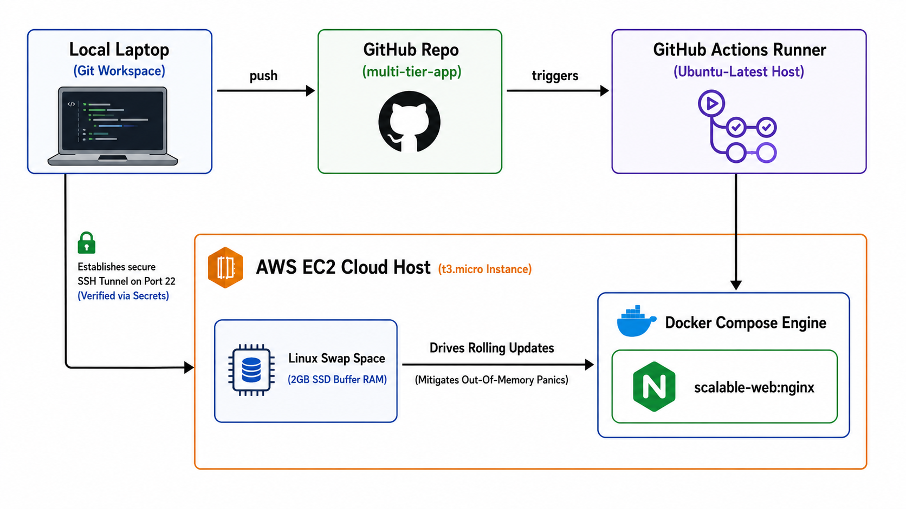

# End-to-End CI/CD Pipeline with Docker & GitHub Actions

An automated, production-grade Continuous Deployment (CD) pipeline that bridges local development with cloud infrastructure. This system listens for code updates on the `main` branch, handles cryptographic authentication, tunnels securely into an AWS environment, and triggers containerized service rollouts with zero manual intervention.

## 🏗️ System Architecture


  ┌─────────────────┐      push      ┌─────────────────┐      triggers     ┌────────────────────────┐
  │  Local Laptop   │───────────────>│  GitHub Repo    │──────────────────>│ GitHub Actions Runner  │
  │(Git Workspace)  │                │(multi-tier-app) │                   │ (Ubuntu-Latest Host)   │
  └─────────────────┘                └─────────────────┘                   └───────────┬────────────┘
  │
  │ Establishes secure
  │ SSH Tunnel on Port 22
  │ (Verified via Secrets)
  ▼
  ┌─────────────────────────────────────────────────────────────────────────────────────────────────┐
  │ AWS EC2 Cloud Host (t3.micro Instance)                                                          │
  │                                                                                                 │
  │  ┌───────────────────────┐         Drives Rolling Updates         ┌──────────────────────────┐  │
  │  │   Linux Swap Space    │───────────────────────────────────────>│   Docker Compose Engine  │  │
  │  │ (2GB SSD Buffer RAM)  │  (Mitigates Out-Of-Memory Panics)      │ ┌──────────────────────┐ │  │
  │  └───────────────────────┘                                        │ │   scalable-web:nginx │ │  │
  │                                                                   │ └──────────────────────┘ │  │
  │                                                                   └──────────────────────────┘  │
  └─────────────────────────────────────────────────────────────────────────────────────────────────┘

---

> 💡 **📍 ARCHITECTURE DIAGRAM**

<p align="center">
  
</p>

---

## ⚡ Key Features

* **Automated Git-Triggered Continuous Deployment:** Eliminates manual server intervention by tracking production branch pushes and triggering isolated workflow jobs.
* **Cryptographic Secret Masking:** Secures system integration strings (`AWS_HOST`, `AWS_PRIVATE_KEY`) away from source control via encrypted GitHub Environment Secrets.
* **Containerized Service Layering:** Standardizes application delivery using Docker Compose to handle localized, decoupled network configurations.
* **OS Kernel Virtual Memory Optimization:** Mitigates hardware limitations on low-resource infrastructure (`t3.micro` instance runtime limits) using customized Linux Swap allocation strategies.

## 🛠️ Technology Stack

* **CI/CD Engine:** GitHub Actions
* **Cloud Provider:** Amazon Web Services (AWS EC2)
* **Operating System:** Ubuntu Server LTS
* **Container Runtimes:** Docker, Docker Compose
* **Security & Transport:** OpenSSH, RSA Cryptography Keyrings

---

## 🚀 Infrastructure Setup Details

### 1. Host Memory Virtualization (Swap Space Allocation)
To handle intense memory spikes during container building on cloud instances running strictly 1GB physical RAM, allocate a secure SSD virtual page memory buffer on your host virtual machine:

```bash
# Allocate a 2GB swap file size structure
sudo fallocate -l 2G /swapfile

# Set strict read/write security permissions
sudo chmod 600 /swapfile

# Set up the file as Linux swap area
sudo mkswap /swapfile

# Enable the swap file immediately
sudo swapon /swapfile

# Make the configuration persist through system reboots
echo '/swapfile none swap sw 0 0' | sudo tee -a /etc/fstab
